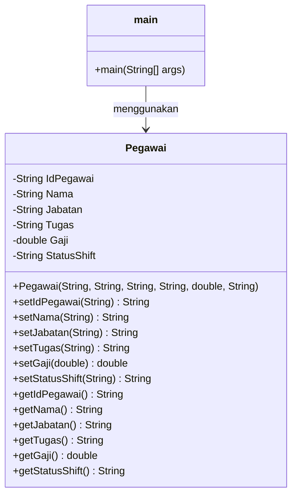

# TP1DPBO2526C2 — Sistem Data Pegawai Bioskop

Saya **Luthfi Aulia Jodi** dengan NIM **2521743** mengerjakan Tugas Praktikum 1 dalam mata kuliah Desain Pemrograman Berbasis Objek untuk keberkahan-Nya maka saya tidak melakukan kecurangan seperti yang dispesifikasikan. Aamiin.

---

## Deskripsi Program

Tugas Praktikum 1 (DPBO 2025/2026, kelas C2): program **pengelolaan data pegawai bioskop** yang dibuat menggunakan pendekatan **Pemrograman Berorientasi Objek (OOP)** dalam bahasa **Java**.

Program ini digunakan untuk mengelola data pegawai bioskop, mulai dari menambahkan data, melihat seluruh data, melihat detail pegawai, mencari pegawai, mengubah data, menghapus data, serta melihat daftar jabatan dan shift yang tersedia.

Program menggunakan dua class utama:

* `Pegawai` sebagai **model** yang menyimpan data setiap pegawai.
* `main` sebagai **program utama** yang menangani menu, input pengguna, dan proses pengelolaan data.

---

## Daftar Isi

1. [Struktur Folder](#1-struktur-folder)
2. [Desain Program](#2-desain-program)
3. [Alur Kode](#3-alur-kode)
4. [Cara Menjalankan](#4-cara-menjalankan)
5. [Dokumentasi Program](#5-dokumentasi-program)
6. [Catatan dan Batasan](#6-catatan-dan-batasan)

---

# 1. Struktur Folder

```text
TPDPBOASPERAK/
├── TP1DPBO2526C2/
│   ├── cpp/
│   │   ├── dokum/
│   │   ├── main.cpp
│   │   ├── main.exe
│   │   └── pegawai.cpp
│   ├── DOKUMENTASI/
│   │   ├── cpp/
│   │   ├── java/
│   │   ├── php/
│   │   └── python/
│   ├── java/
│   │   ├── dokum/
│   │   ├── main.class
│   │   ├── main.java          # program utama + menu
│   │   ├── Pegawai.class
│   │   └── Pegawai.java       # class Pegawai
│   ├── php/
│   │   ├── dokum/
│   │   └── index.php
│   ├── python/
│   │   ├── __pycache__/
│   │   ├── dokum/
│   │   ├── main.py
│   │   └── pegawai.py
│   └── TP1DPBO2526C2/
│       ├── cpp/
│       └── README.md
└── tempCodeRunnerFile.java
```

Keterangan:

| Folder / File | Isi |
| --- | --- |
| `cpp/`, `java/`, `php/`, `python/` | Source code program dalam masing-masing bahasa |
| `dokum/` | Screenshot hasil program per bahasa |
| `DOKUMENTASI/` | Kumpulan dokumentasi (screenshot) yang dikelompokkan per bahasa |
| `*.class`, `main.exe`, `__pycache__/` | Hasil kompilasi / cache otomatis |
| `README.md` | Penjelasan program |
| `tempCodeRunnerFile.java` | File sementara dari ekstensi Code Runner |

# 2. Desain Program

## 2.1 Konsep OOP yang Digunakan

| Konsep                       | Penerapan                                                                                                                                |
| ---------------------------- | ---------------------------------------------------------------------------------------------------------------------------------------- |
| **Class & Object**           | `Pegawai` digunakan sebagai class untuk merepresentasikan data seorang pegawai. Setiap data pegawai yang dibuat merupakan sebuah object. |
| **Enkapsulasi**              | Semua atribut pada class `Pegawai` dibuat `private` dan diakses menggunakan getter dan setter.                                           |
| **Konstruktor**              | Constructor `Pegawai()` digunakan untuk membuat object sekaligus mengisi seluruh data pegawai.                                           |
| **Getter**                   | Digunakan untuk mengambil nilai atribut seperti `getNama()`, `getJabatan()`, dan `getGaji()`.                                            |
| **Setter**                   | Digunakan untuk mengubah data pegawai seperti `setNama()`, `setJabatan()`, dan `setGaji()`.                                              |
| **Array of Object**          | Data pegawai disimpan menggunakan array `Pegawai[] daftarPegawai` dengan kapasitas maksimal 100 object.                                  |
| **Pemisahan tanggung jawab** | Class `Pegawai` bertanggung jawab terhadap data pegawai, sedangkan `main` menangani menu dan proses pengelolaan data.                    |

---

## 2.2 Class `Pegawai`

Class `Pegawai` digunakan untuk menyimpan informasi dari setiap pegawai bioskop.

### Atribut

| Atribut       | Tipe     | Keterangan                                         |
| ------------- | -------- | -------------------------------------------------- |
| `IdPegawai`   | `String` | ID unik dari pegawai                               |
| `Nama`        | `String` | Nama pegawai                                       |
| `Jabatan`     | `String` | Jabatan pegawai di bioskop                         |
| `Tugas`       | `String` | Tugas atau pekerjaan yang dilakukan pegawai        |
| `Gaji`        | `double` | Besaran gaji pegawai                               |
| `StatusShift` | `String` | Shift kerja pegawai, yaitu pagi, siang, atau malam |

### Method

| Method             | Fungsi                                                               |
| ------------------ | -------------------------------------------------------------------- |
| `Pegawai(...)`     | Constructor untuk membuat object pegawai dan mengisi seluruh atribut |
| `setIdPegawai()`   | Mengubah ID pegawai                                                  |
| `setNama()`        | Mengubah nama pegawai                                                |
| `setJabatan()`     | Mengubah jabatan pegawai                                             |
| `setTugas()`       | Mengubah tugas pegawai                                               |
| `setGaji()`        | Mengubah gaji pegawai                                                |
| `setStatusShift()` | Mengubah shift pegawai                                               |
| `getIdPegawai()`   | Mengambil ID pegawai                                                 |
| `getNama()`        | Mengambil nama pegawai                                               |
| `getJabatan()`     | Mengambil jabatan pegawai                                            |
| `getTugas()`       | Mengambil tugas pegawai                                              |
| `getGaji()`        | Mengambil gaji pegawai                                               |
| `getStatusShift()` | Mengambil shift sekaligus mengubahnya menjadi format jam kerja       |

### Pengolahan Shift

Method `getStatusShift()` tidak hanya mengembalikan isi `StatusShift`, tetapi juga memberikan informasi jam kerja.

```text
pagi  → 08.00 - 13.00 WIB (Pagi)
siang → 13.00 - 18.00 WIB (Siang)
malam → 18.00 - 23.00 WIB (Malam)
```

Jika data shift selain tiga pilihan tersebut dimasukkan, method akan mengembalikan:

```text
Shift tidak tersedia
```

---

## 2.3 Class Diagram



Class `main` menggunakan class `Pegawai` untuk membuat dan mengelola object pegawai.

---

## 2.4 Pembagian Tanggung Jawab

| Bagian            | File           | Tugas                                                                                             |
| ----------------- | -------------- | ------------------------------------------------------------------------------------------------- |
| **Model**         | `Pegawai.java` | Menyimpan atribut pegawai serta menyediakan getter dan setter                                     |
| **Program Utama** | `main.java`    | Menampilkan menu, menerima input, membuat object, mencari data, mengubah data, dan menghapus data |
| **Penyimpanan**   | `Pegawai[]`    | Menyimpan kumpulan object pegawai selama program berjalan                                         |

---

## 2.4.1 Fitur Program

Program memiliki 9 menu utama:

| Menu | Fitur                    | Fungsi                            |
| ---- | ------------------------ | --------------------------------- |
| `1`  | Tambah Data Pegawai      | Menambahkan pegawai baru          |
| `2`  | Lihat Semua Data Pegawai | Menampilkan seluruh data          |
| `3`  | Lihat Detail Pegawai     | Menampilkan data berdasarkan ID   |
| `4`  | Cari Pegawai             | Mencari pegawai berdasarkan nama  |
| `5`  | Ubah Data Pegawai        | Mengubah data pegawai             |
| `6`  | Hapus Data Pegawai       | Menghapus data berdasarkan ID     |
| `7`  | Lihat Daftar Jabatan     | Menampilkan jabatan yang tersedia |
| `8`  | Lihat Daftar Shift       | Menampilkan daftar shift          |
| `9`  | Keluar                   | Mengakhiri program                |

---

## 2.5 Penyimpanan Data

Program menggunakan array object:

```java
Pegawai[] daftarPegawai = new Pegawai[100];
```

Array tersebut memiliki kapasitas maksimal **100 pegawai**.

Jumlah data yang sedang digunakan disimpan pada variabel:

```java
int jumlahPegawai = 0;
```

Contohnya ketika terdapat 5 data pegawai:

```text
daftarPegawai[0] → Pegawai 1
daftarPegawai[1] → Pegawai 2
daftarPegawai[2] → Pegawai 3
daftarPegawai[3] → Pegawai 4
daftarPegawai[4] → Pegawai 5

jumlahPegawai = 5
```

Data hanya disimpan di dalam **memori selama program berjalan**. Setelah program ditutup, data yang ditambahkan atau diubah akan hilang.

---

# 3. Alur Kode

## 3.1 Alur Utama Program

Program dimulai dengan membuat object `Scanner` untuk membaca input pengguna.

```java
Scanner input = new Scanner(System.in);
```

Kemudian dibuat array untuk menyimpan object `Pegawai`.

```java
Pegawai[] daftarPegawai = new Pegawai[100];
```

Program juga memasukkan **5 data awal pegawai**.

Setelah itu program masuk ke dalam perulangan `do-while`.

```text
Mulai
  ↓
Membuat Scanner
  ↓
Membuat array Pegawai[100]
  ↓
Memasukkan 5 data awal
  ↓
Menampilkan menu
  ↓
User memilih menu
  ↓
Menjalankan fitur
  ↓
Kembali ke menu
  ↓
Pilihan = 9?
  ├── Tidak → kembali ke menu
  └── Ya → Program selesai
```

---

## 3.2 Data Awal

Program memiliki 5 data pegawai yang langsung dibuat ketika program dijalankan:

| ID         | Nama                    | Jabatan          | Shift |
| ---------- | ----------------------- | ---------------- | ----- |
| `A2521001` | Agus Yamaha             | Kasir            | Pagi  |
| `A2521002` | Budiono Siregar         | Petugas Tiket    | Siang |
| `A2521003` | Yusup Telolet           | Cleaning Service | Malam |
| `A2521004` | Tedy Boy Friend Prabowo | Security         | Pagi  |
| `A2521005` | Luthfi Aulia Jodi       | Supervisor / CEO | Malam |

Jumlah awal:

```java
jumlahPegawai = 5;
```

---

## 3.3 Tambah Data Pegawai

Pada menu `1`, program melakukan proses penambahan data.

Alurnya:

```text
Pilih menu 1
   ↓
Cek apakah jumlah pegawai sudah 100
   ↓
Masukkan ID Pegawai
   ↓
Cek apakah ID sudah digunakan
   ↓
Jika sudah → tampilkan pesan error
   ↓
Jika belum
   ↓
Masukkan Nama
   ↓
Masukkan Jabatan
   ↓
Masukkan Tugas
   ↓
Masukkan Gaji
   ↓
Masukkan Shift
   ↓
Buat object Pegawai baru
   ↓
Simpan ke daftarPegawai[jumlahPegawai]
   ↓
jumlahPegawai++
```

Pengecekan ID dilakukan supaya dua pegawai tidak mempunyai ID yang sama.

```java
if (daftarPegawai[i].getIdPegawai().equalsIgnoreCase(IdPegawai))
```

---

## 3.4 Lihat Semua Data

Menu `2` digunakan untuk menampilkan seluruh pegawai.

Program melakukan pengecekan:

```text
jumlahPegawai == 0?
```

Jika tidak ada data:

```text
Data pegawai tidak tersedia.
```

Jika terdapat data, program melakukan perulangan:

```java
for (int i = 0; i < jumlahPegawai; i++)
```

Kemudian setiap object pegawai ditampilkan menggunakan getter.

Contohnya:

```java
daftarPegawai[i].getNama()
daftarPegawai[i].getJabatan()
daftarPegawai[i].getTugas()
daftarPegawai[i].getGaji()
daftarPegawai[i].getStatusShift()
```

---

## 3.5 Lihat Detail Pegawai

Menu `3` digunakan untuk melihat satu pegawai berdasarkan ID.

Alurnya:

```text
Masukkan ID
   ↓
Loop seluruh data
   ↓
Bandingkan ID
   ↓
ID ditemukan?
 ├── Ya → tampilkan detail pegawai
 └── Tidak → tampilkan pesan tidak ditemukan
```

Pencarian menggunakan:

```java
equalsIgnoreCase()
```

Sehingga pencarian tidak membedakan huruf besar dan kecil.

---

## 3.6 Cari Pegawai

Menu `4` digunakan untuk mencari pegawai berdasarkan **nama**.

User memasukkan nama:

```text
Masukkan nama pegawai:
```

Kemudian program membandingkan nama yang dimasukkan dengan nama pada setiap object.

Jika ditemukan, seluruh informasi pegawai ditampilkan.

---

## 3.7 Ubah Data Pegawai

Menu `5` digunakan untuk mengubah data pegawai.

Pertama program menampilkan daftar pegawai, kemudian user memasukkan ID pegawai yang ingin diubah.

Setelah pegawai ditemukan, program menampilkan pilihan:

```text
1. Nama
2. Jabatan
3. Tugas
4. Gaji
5. Shift
6. Kembali
```

User dapat mengubah atribut satu per satu.

Contohnya untuk mengubah nama:

```java
daftarPegawai[i].setNama(namaBaru);
```

Untuk mengubah gaji:

```java
daftarPegawai[i].setGaji(gajiBaru);
```

Program menggunakan `do-while` sehingga user dapat mengubah beberapa atribut sebelum kembali ke menu utama.

---

## 3.8 Hapus Data Pegawai

Menu `6` digunakan untuk menghapus data berdasarkan ID.

Program terlebih dahulu mencari ID pegawai.

Jika ditemukan, program meminta konfirmasi:

```text
Yakin ingin menghapus data ini? (ya/tidak):
```

Jika user memilih `ya`, data setelah posisi yang dihapus digeser satu posisi ke kiri.

Contoh:

```text
Sebelum:

[0] Agus
[1] Budiono
[2] Yusup
[3] Tedy

Hapus index 1:

[0] Agus
[1] Yusup
[2] Tedy
```

Proses penggeseran dilakukan dengan:

```java
for (int j = i; j < jumlahPegawai - 1; j++) {
    daftarPegawai[j] = daftarPegawai[j + 1];
}
```

Kemudian:

```java
jumlahPegawai--;
```

Dengan begitu jumlah data aktif berkurang satu.

---

## 3.9 Daftar Jabatan

Menu `7` menampilkan daftar jabatan yang tersedia:

```text
1. Kasir
2. Petugas Tiket
3. Cleaning Service
4. Security
5. Supervisor
```

Menu ini hanya menampilkan informasi dan tidak mengubah data pegawai.

---

## 3.10 Daftar Shift

Menu `8` menampilkan pembagian shift:

```text
1. Pagi  : 08.00 - 13.00
2. Siang : 13.00 - 18.00
3. Malam : 18.00 - 23.00
```

Pada class `Pegawai`, informasi shift juga diproses melalui method `getStatusShift()`.

---

## 3.11 Keluar

Menu `9` digunakan untuk mengakhiri program.

Karena menu utama menggunakan:

```java
} while (pilihan != 9);
```

maka program akan terus berjalan selama pilihan bukan `9`.

Ketika user memilih `9`, program menampilkan:

```text
Program ditutup.
Terima kasih telah menggunakan sistem.
```

Kemudian `Scanner` ditutup.

---

# 4. Cara Menjalankan

## Java

Pastikan Java/JDK sudah terpasang.

Masuk ke folder yang berisi kedua file:

```text
cd Java
```

Kemudian compile:

```text
javac main.java Pegawai.java
```

Setelah berhasil compile, jalankan:

```text
java main
```

Program kemudian akan menampilkan:

```text
========================================
       SISTEM DATA PEGAWAI BIOSKOP
========================================
1. Tambah Data Pegawai
2. Lihat Semua Data Pegawai
3. Lihat Detail Pegawai
4. Cari Pegawai
5. Ubah Data Pegawai
6. Hapus Data Pegawai
7. Lihat Daftar Jabatan
8. Lihat Daftar Shift
9. Keluar
========================================
Pilih menu:
```

---

# 5. Dokumentasi Program

## 5.1 Menu Utama

Menampilkan seluruh pilihan fitur yang tersedia dalam program.


---

## 5.2 Tambah Data Pegawai

User dapat memasukkan ID, nama, jabatan, tugas, gaji, dan shift pegawai.


---

## 5.3 Lihat Semua Data Pegawai

Menampilkan seluruh data pegawai yang tersimpan dalam array.


---

## 5.4 Detail Pegawai

User memasukkan ID untuk melihat informasi lengkap seorang pegawai.


---

## 5.5 Cari Pegawai

User dapat mencari pegawai berdasarkan nama.


---

## 5.6 Ubah Data Pegawai

User memilih ID pegawai kemudian memilih atribut yang ingin diubah.


---

## 5.7 Hapus Data Pegawai

Program meminta konfirmasi sebelum data pegawai dihapus.


---

## 5.8 Daftar Jabatan

Menampilkan jabatan yang tersedia pada sistem.


---

## 5.9 Daftar Shift

Menampilkan pembagian waktu kerja pegawai.


---

# 6. Catatan dan Batasan

### Penanganan Input

| Bagian         | Yang Ditangani                                    | Yang Belum Ditangani                                  |
| -------------- | ------------------------------------------------- | ----------------------------------------------------- |
| Kapasitas data | Jumlah pegawai dibatasi maksimal 100              | Tidak dapat menambah data jika array penuh            |
| ID Pegawai     | ID duplikat dicegah saat penambahan               | Validasi format ID belum diterapkan                   |
| Pencarian ID   | Menggunakan `equalsIgnoreCase()`                  | Tidak menggunakan pencarian sebagian ID               |
| Pencarian Nama | Menggunakan `equalsIgnoreCase()`                  | Harus memasukkan nama secara lengkap                  |
| Hapus Data     | Meminta konfirmasi `ya/tidak`                     | Input selain `ya/tidak` dianggap sebagai batal        |
| Shift          | Menyediakan pagi, siang, dan malam                | Input shift belum dibatasi hanya pada tiga pilihan    |
| Input angka    | Gaji menggunakan `double`, menu menggunakan `int` | Input huruf pada bagian angka dapat menyebabkan error |

### Hal Lain yang Perlu Diketahui

* Program menggunakan **array statis** dengan kapasitas maksimal 100 object.
* Data pegawai hanya disimpan selama program berjalan.
* Tidak menggunakan database atau file eksternal.
* Ketika program ditutup, data yang ditambahkan atau diubah tidak disimpan.
* `Pegawai` menggunakan atribut `private` sehingga akses data dilakukan melalui getter dan setter.
* `StatusShift` disimpan sebagai teks seperti `pagi`, `siang`, atau `malam`.
* `getStatusShift()` mengubah input shift menjadi informasi jam kerja.
* ID pegawai digunakan sebagai identitas untuk proses detail, update, dan delete.
* Penghapusan data dilakukan dengan cara **menggeser object setelah index yang dihapus ke kiri**.
* Program menggunakan `Scanner` untuk menerima input dari pengguna.
* Program menggunakan `do-while` agar menu terus ditampilkan sampai pengguna memilih menu `9`.
* Program belum menggunakan inheritance, polymorphism, atau interface karena desain program berfokus pada penerapan **class, object, encapsulation, constructor, getter/setter, dan array of object**.
